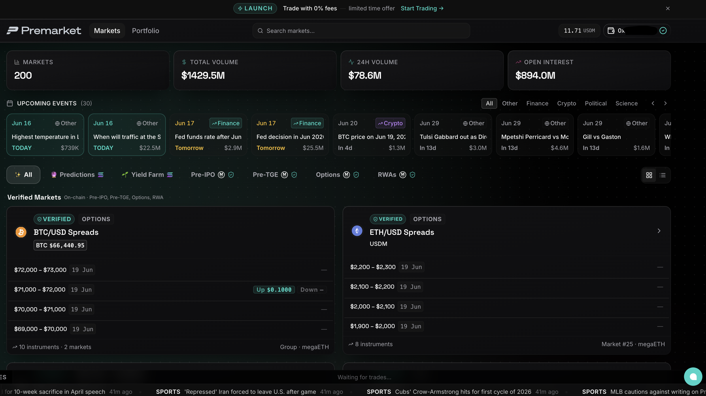

# Welcome to Premarket

## Context

Most assets only become tradable after they exist. By the time a token lists, an IPO prices, or an event resolves, the earliest and most profitable window has already closed. The people who got in early made their conviction known when it mattered most and got paid for it. Everyone else arrived too late.

## Introduction

<figure><figcaption></figcaption></figure>

Premarket is a trading platform for assets and outcomes that do not exist yet. Before a token launches, before a company goes public, before an event resolves, you can already take a position on what you think will happen.

## Market Types

There are two types of markets on Premarket:

**1. FDV Band Markets**

Trade valuation ranges on pre-TGE tokens and pre-IPO assets. You pick a band and if the asset launches within that range, you get paid.

> **Example:** You believe Monad will launch at a $2B to $3B valuation. You buy that band. If Monad's FDV lands anywhere between $2B and $3B at launch, your position pays out.

**2. Prediction Markets**

Trade binary outcomes on real world events. Back the correct outcome and each share pays $1 at settlement.

> **Example:** You believe MegaETH will launch before the end of Q2. You buy YES. If it does, every share pays $1. If it does not, your shares expire at $0.

Both market types run on a live orderbook. Prices are not set by the platform, they emerge from real buy and sell orders. A higher price means the market collectively believes something is more likely. You can enter and exit positions freely before settlement, as long as someone is willing to take the other side.

<figure><figcaption></figcaption></figure>

<figure><figcaption></figcaption></figure>


**Before you start:**

* You can lose your full position if the outcome goes against you.
* Early exit depends on available liquidity, it is never guaranteed.
* Settlement at expiry is always guaranteed, even if you could not exit early.


Head to [Getting Started](setup.md) next, for steps on account setup and get ready to place your first trade.
