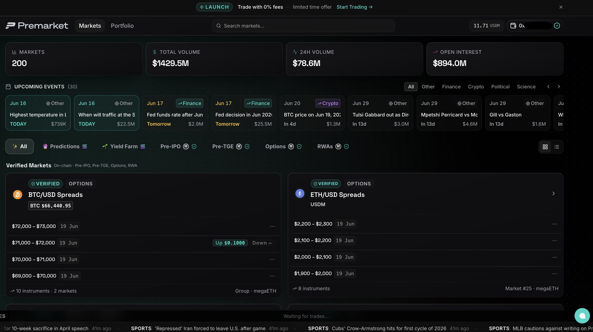

# Welcome to Premarket

Most assets only become tradable after they already exist. By the time a token lists, an IPO prices, or an event resolves, the earliest and most profitable window has already closed. The people who got in early made their conviction known when it mattered most and got paid for it. Everyone else arrived too late. Premarket exists to move trading earlier.

## Introduction

<figure><figcaption>
Premarket application homepage
</figcaption></figure>

Premarket is a trading platform for assets and outcomes before they exist or resolve anywhere else. Before a token launches, before a company goes public, before an event resolves, you can already take a position on what you think will happen. The platform also supports trading on existing assets through options and tokenised real world assets.

## Product Types and Market Categories

Premarket uses a similar interface across products, but payout logic, infrastructure, and settlement differ by product. The main product structures are Prediction Markets on Solana, Options Markets on MegaETH, and RWA/Spot Markets on MegaETH. Labels such as Yield Farm, Pre IPO, and Pre TGE are views or categories within those product structures.

### 1. Prediction Markets

Trade binary YES/NO outcomes on real world events. These markets are powered by DFlow, which tokenizes Kalshi markets on Solana. If the market resolves normally, each winning share is redeemable for $1 and losing shares expire at $0.

> **Example:** You believe MegaETH will launch before the end of Q2. You buy YES. If it does, every share pays $1. If it does not, your shares expire at $0.

### 2. Yield Farm View

A curated view on top of Prediction Markets. Yield Farm surfaces high probability outcome legs trading below $1, with the spread to $1 representing yield if the position resolves correctly. It is not a separate product type. Same chain as Prediction Markets (Solana), same settlement currency (USDC), same manual redemption through DFlow.

> **Example:** A leg priced at 91¢ implies the market believes there is a 91% chance the outcome resolves YES. You buy at 91¢, hold to settlement, and if correct you collect $1. Yield is 9¢ per share.

### 3. Pre IPO Markets

Trade valuation spreads on private companies before they go public. Pre IPO is a market category for options-style valuation spreads unless the market rules specify different mechanics. Runs on MegaETH with USDM. No Pre IPO markets are currently live.

### 4. Pre TGE Markets

Trade valuation spreads on tokens before launch. Pre TGE is a market category for options-style valuation spreads unless the market rules specify different mechanics. Runs on MegaETH with USDM. No Pre TGE markets are currently live.

> **Example:** You believe a token will launch above $2B. You buy LONG on the $2B to $3B spread. If it lists at $2.4B, you receive a partial payout that scales with how far into the range it lands. If it lists at $3B or above, LONG receives the maximum payout. If it lists below $2B, SHORT would be the max-winning side.

### 5. Options Markets

Trade structured Long or Short exposure on existing assets using predefined strike ranges. Each spread has two sides, LONG and SHORT, which split a combined value of $1 at settlement. Runs on MegaETH with USDM. Live markets are BTC/USD, ETH/USD, HYPE/USD, and ZEC/USD Spreads.

<figure><figcaption>
Options chain with buy and sell choices
</figcaption></figure>

> **Example:** ETH is trading around $2,290. You buy LONG on the $2,400 to $2,500 spread because you want exposure that increases as ETH settles higher through the range. If ETH settles within the range, LONG payout scales linearly toward the upper strike. If it settles at $2,500 or above, LONG receives the maximum payout. If it settles below $2,400, SHORT receives the maximum payout.

### 6. RWA / Spot Markets

<figure><figcaption>
RWA market example with buy and sell options
</figcaption></figure>

Trade tokenised real world assets directly against USDM. These are perpetual spot markets with no expiry. Profit or loss is realised only when you sell. Runs on MegaETH. Live markets are Fullerene C60 99.5%, Fullerene C60 99.9%, Fullerene C70 98%, and Fullerene C70 99.9%, all per gram.

> **Example:** You buy 1g Fullerene C60 99.5% using USDM at the current market price. The market is perpetual with no expiry, so you hold the position as long as you want and sell back to USDM when you choose to exit. Your profit or loss is the difference between your buy and sell price.

<figure><figcaption>
Premarket app overview
</figcaption></figure>

## How All Markets Work

All market types run on a live orderbook. Prices are not set by the platform, they emerge from real buy and sell orders. A higher price means the market collectively believes something is more likely. You can enter and exit positions freely before settlement, as long as someone is willing to take the other side.


**Before you start:**

* You can lose your full position if the outcome goes against you.
* Early exit depends on available liquidity, it is never guaranteed.
* If a market resolves normally, settlement follows the market rules. Options-style MegaETH markets are cash-settled at expiry, while Prediction Markets and Yield Farm run on Solana and require manual redemption through DFlow.
* RWA/Spot Markets do not have expiry-based settlement. You realise value by selling or holding the asset.
* Prediction Markets and Yield Farm require identity verification and are not available in all regions. All other markets do not require verification.


<figure><figcaption>
Example market page
</figcaption></figure>

Head to [Getting Started](setup.md) next, for steps on account setup and your first trade.
